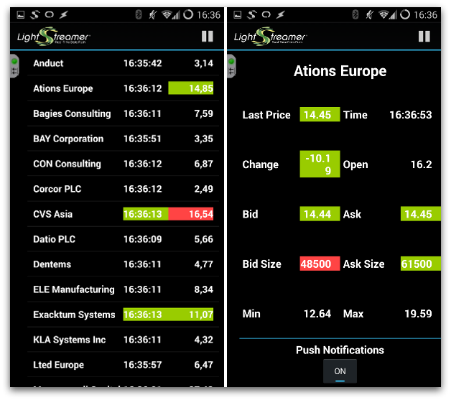
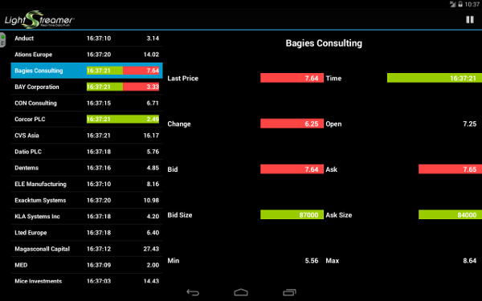

# Lightstreamer - MPN Stock-List Demo - Android Client

<!-- START DESCRIPTION lightstreamer-example-stocklist-client-android -->

This project contains a full example of an Android application that employs the [Lightstreamer Android Client library](http://www.lightstreamer.com/latest/Lightstreamer_Allegro-Presto-Vivace_6_0_Colosseo/Lightstreamer/DOCS-SDKs/sdk_client_android/doc/API-reference/index.html).

## Live Demo

[](https://play.google.com/store/apps/details?id=com.lightstreamer.demo.stocklistdemo_advanced)
 
[](https://play.google.com/store/apps/details?id=com.lightstreamer.demo.stocklistdemo_advanced)


###[ View live demo](https://market.android.com/details?id=com.lightstreamer.demo.android)
(To install the app from the Google Play Store you can also use the above QR code)


## Details

This is a Java-for-Android version of the [Lightstreamer - Basic Stock-List Demo - HTML client](https://github.com/Weswit/Lightstreamer-example-StockList-client-javascript#basic-stock-list-demo---html-client).<br>
This app uses the <b>Android Client API for Lightstreamer</b> to handle the communications with Lightstreamer Server. A simple user interface is implemented to display the real-time data received from Lightstreamer Server.<br>

Touch a row opens a new panel with the detailed info, updated in real time, of the stock.

The demo is ready to receive Mobile Push Notification through [Google Cloud Messaging for Android](https://developer.android.com/google/gcm/index.html).

### Dig the code

* `StockListDemo.java` is the entry point and only `Activity` of the application. It contains two `Fragment`s, the status of
the application and acts as a proxy to the LightstreamerClient instance. The two `Fragment` are both visible if the application
runs on tablet; on the contrary only one `Fragment` is visible and are exchanged based on the user interaction
* `LightstreamerClient.java` handles the connection to the Lightstreamer server and the Subscription/Unsubscription requests
issued by the various part of the application.
* `SubscriptionFragment.java` represents a `Fragment` containing a subscription that is started/stopped based on the lifecycle of 
the `Fragment`. Please note that this class do not actually extend `Fragment`.
* `StocksFragment.java` and `DetailsFragment.java` are the classes representing the two fragments of the application. 
* `GcmIntentService.java` is the class dedicated to receive the Push Notifications, to create the notification for the system and 
to attaching to it a Intent capable of launching the Demo application focused on the notified item.


Check out the sources for further explanations.
  
<i>NOTE: not all the functionalities of the Lightstreamer Android Java client are exposed by the classes listed above. You can easily expand those functionalities using the [Android Client API](http://www.lightstreamer.com/latest/Lightstreamer_Allegro-Presto-Vivace_6_0_Colosseo/Lightstreamer/DOCS-SDKs/sdk_client_android/doc/API-reference/index.html) as a reference. If in trouble check out the [specific Lightstreamer forum](http://forums.lightstreamer.com/forumdisplay.php?33-Android-Client-API).</i>

<!-- END DESCRIPTION lightstreamer-example-mpnstocklist-client-android -->

## Install

If you want to install a version of this demo pointing to your local Lightstreamer Server and running into 
an [Adroid Virtual Device](http://developer.android.com/tools/devices/emulator.html), follow these steps:

* Note that, as prerequisite, the [Lightstreamer - Stock- List Demo - Java Adapter](https://github.com/Weswit/Lightstreamer-example-Stocklist-adapter-java) 
has to be deployed on your local Lightstreamer Server instance. Please check out that project and follow the installation 
instructions provided with it. 
* Launch Lightstreamer Server.
* Download the `deploy.zip` file that you can find in the [deploy release](https://github.com/Weswit/Lightstreamer-example-StockList-client-android/releases) 
of this project and extract the `Android_StockListDemo_Basic.apk` file.
* Locate or install the [Android SDK](http://developer.android.com/sdk/index.html)
* Install the `Android_StockListDemo_Basic.apk` in your emulator:
  * Execute the emulator (Android SDK/SDK Manager->Tools->Manage AVDs...->New then Start)
  * Open the console and move to the platform-tools folder of SDK directory.
  * Then type the following command:
    ```
    adb install [.apk path]
    ```
* Look up the demo in your virtual device and launch it.

<i>Note that the demo targets the Lightstreamer server @ http://10.0.2.2:8080 since 10.0.2.2 is the special alias to your host loopback interface.</i>

## Build

To build your own version of the demo please consider that this example is comprised of the following folders:
* `/src` Contains the sources to build the Java-for-Android application.
* `/res` Contains the images and other resourced needed to the demo. 
* `/lib` Drop here the `ls-android-client.jar` from the Lighstreamer SDK for Android Clients, to be used for the build process.

The demo has also references to the [Google Play Services lib](https://developer.android.com/google/play-services/setup.html) 
and to the [v7 Support Library](https://developer.android.com/tools/support-library/setup.html).
  
### Getting Started

You can import the sources on a new project on [Eclipse](http://www.eclipse.org/) (provided you installed the necessary
[ADT plugin](http://developer.android.com/sdk/eclipse-adt.html)) or on [Android Studio](https://developer.android.com/sdk/installing/studio.html).
In the former case you'll need to separately download the [Android SDK](http://developer.android.com/sdk/).

Once the project has been imported a couple of dependencies have to be satisfied: `android-support-v7-appcompat` and `google-play-services_lib`.
Please follow the related guides: [Google Play Services lib](https://developer.android.com/google/play-services/setup.html) and 
[v7 Support Library](https://developer.android.com/tools/support-library/setup.html).

### Push Notifications

* Before running the application for the first time you might want to fill the `senderId` constant in the `res/values/strings.xml` file 
with your own [GCM sender ID](http://developer.android.com/google/gcm/gs.html).
* It is also required that the Lightstreamer Server pointed by the demo application is properly configured to handle Push Notification
Subscriptions. See the server documentation for further details.
 
You can skip these steps: in this case push notifications will be disabled. 

### Compile and Run

To run the demo a suitable emulated or real device is required. To run the demo you'll need at least android 2.1. 
To receive push notification you'll need a Google account configured on the system. In case the emulator is used a "Google APIs" 
OS image has to be used.

* On eclipse right-click on the project in the Package Explorer and click Run As -> Android Application, then follow the instructions.
* On Android Studio select Run from the menu and choose "Run", then follow the instructions

### Deploy
  
You may run the demo against your local server or using our online server at http://push.lightstreamer.com:80. The server to which the demo will connect to is configured in the `res/values/strings.xml` file.
In the former case, the example requires that the [QUOTE_ADAPTER](https://github.com/Weswit/Lightstreamer-example-Stocklist-adapter-java) and [LiteralBasedProvider](https://github.com/Weswit/Lightstreamer-example-ReusableMetadata-adapter-java) have to be deployed in your local Lightstreamer server instance. 
The factory configuration of Lightstreamer server already provides this adapter deployed. Extra configuration on the server to enable
Push Notification might be needed.<br>

## See Also

### Lightstreamer Adapters Needed by This Demo Client

<!-- START RELATED_ENTRIES -->

* [Lightstreamer - Stock-List Demo - Java Adapter](https://github.com/Weswit/Lightstreamer-example-Stocklist-adapter-java)
* [Lightstreamer - Reusable Metadata Adapters - Java Adapter](https://github.com/Weswit/Lightstreamer-example-ReusableMetadata-adapter-java)

<!-- END RELATED_ENTRIES -->

### Related Projects

* [Lightstreamer - Stock-List Demos - HTML Clients](https://github.com/Weswit/Lightstreamer-example-Stocklist-client-javascript)
* [Lightstreamer - Basic Stock-List Demo - jQuery (jqGrid) Client](https://github.com/Weswit/Lightstreamer-example-StockList-client-jquery)
* [Lightstreamer - Stock- List Demo Dojo Toolkit Client](https://github.com/Weswit/Lightstreamer-example-StockList-client-dojo)
* [Lightstreamer - Basic Stock-List Demo - .NET Client](https://github.com/Weswit/Lightstreamer-example-StockList-client-dotnet)
* [Lightstreamer - Round-Trip Demo - HTML Client](https://github.com/Weswit/Lightstreamer-example-RoundTrip-client-javascript)

## Lightstreamer Compatibility Notes

* Compatible with Lightstreamer Android Client API v. 1.1 or newer.
* For Lightstreamer Allegro (+ Android Client API support), Presto, Vivace.
