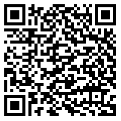

# Lightstreamer - Stock-List Demo with GCM Push Notifications - Android Client


This project contains a full example of an Android application that employs the [Lightstreamer Android Client library](http://www.lightstreamer.com/docs/client_android_api/index.html)
to subscribe to real-time updates and GCM push notifications.

A simpler version, without GCM support is also available: [Stock-List Demo - Android Client](https://github.com/Lightstreamer/Lightstreamer-example-AdvStockList-client-android)


## Live Demo

[](https://play.google.com/store/apps/details?id=com.lightstreamer.demo.android)
 
[](https://play.google.com/store/apps/details?id=com.lightstreamer.demo.android)



### [ View live demo](https://market.android.com/details?id=com.lightstreamer.demo.android)
(To install the app from the Google Play Store, you can also use the above QR code)


## Details

This is a Java-for-Android version of the [Lightstreamer - Basic Stock-List Demo - HTML client](https://github.com/Lightstreamer/Lightstreamer-example-StockList-client-javascript#basic-stock-list-demo---html-client).<br>
This app uses the <b>Android Client API for Lightstreamer</b> to handle the communications with Lightstreamer Server. A simple user interface is implemented to display the real-time data received from Lightstreamer Server.<br>

Touch a row opens a new panel with the detailed information, updated in real-time, of the stock.

Touch the chart to setup a new trigger for push notifications.
    
The demo is ready to receive Mobile Push Notification through [Google Cloud Messaging for Android](https://developer.android.com/google/gcm/index.html).

### Dig the Code

* `StockListDemo.java` is the entry point and only `Activity` of the application. It contains two `Fragment`s, the status of
the application, and acts as a proxy to the LightstreamerClient instance. The two `Fragment` are both visible if the application
runs on tablet; on the contrary, only one `Fragment` is visible and are exchanged based on the user interaction
* `LightstreamerClient.java` handles the connection to the Lightstreamer server and the Subscription/Unsubscription requests
issued by the various part of the application.
* `SubscriptionFragment.java` represents a `Fragment` containing a subscription that is started/stopped based on the lifecycle of 
the `Fragment`. Please note that this class does not actually extend `Fragment`.
* `StocksFragment.java` and `DetailsFragment.java` are the classes representing the two fragments of the application. 
* `GcmIntentService.java` is the class dedicated to receive the Push Notifications, to create the notification for the system, and 
to attach to it an Intent capable of launching the Demo application focused on the notified item.
* `Chart.java` wraps the AndroidPlot APIs to plot the real-time chart on the details fragment.


Check out the sources for further explanations.
  
*NOTE: Not all the functionalities of the Lightstreamer Android Java client are exposed by the classes listed above. You can easily expand those functionalities using the [Android Client API](http://www.lightstreamer.com/docs/client_android_api/index.html) as a reference. If in trouble check out the [specific Lightstreamer forum](http://forums.lightstreamer.com/forumdisplay.php?33-Android-Client-API).*

## Install

If you want to install a version of this demo pointing to your local Lightstreamer Server and running into 
an [Android Virtual Device](http://developer.android.com/tools/devices/emulator.html), follow these steps:

* Note that, as prerequisite, the [Lightstreamer - Stock-List Demo - Java Adapter](https://github.com/Lightstreamer/Lightstreamer-example-Stocklist-adapter-java) 
has to be deployed on your local Lightstreamer Server instance. Please check out that project and follow the installation 
instructions provided with it. 
* Launch Lightstreamer Server.
* Download the `deploy.zip` file, which you can find in the [deploy release](https://github.com/Lightstreamer/Lightstreamer-example-MPNStockList-client-android/releases) 
of this project and extract the `Android_StockListDemo.apk` file.
* Locate or install the [Android SDK](http://developer.android.com/sdk/index.html)
* Install the `Android_StockListDemo.apk` in your emulator:
  * Execute the emulator (Android SDK/SDK Manager->Tools->Manage AVDs...->New then Start)
  * Open the console and move to the platform-tools folder of SDK directory.
  * Then type the following command:
    ```
    adb install [.apk path]
    ```
* Look up the demo in your virtual device and launch it.

*Note that the demo targets the Lightstreamer server @ http://10.0.2.2:8080 because 10.0.2.2 is the special alias to your host loopback interface.*

## Build

### Setup the IDE

Note that you can skip this section and build the application without using any IDE. 

To open the project in [Android Studio](https://developer.android.com/sdk/installing/studio.html), import the provided Gradle project and drop in `app/libs` the library `ls-android-client.jar` from the Lighstreamer SDK for Android Clients.

### Deploy
  
You may run the demo against your local server or using our online server at http://push.lightstreamer.com:80. The server to which the demo will connect to is configured in the `app/src/main/res/values/strings.xml` file.

A full local deploy of this app requires 

* a Lightstreamer Server 6.0 or greater installation with appropriate Mobile Push Notifications (MPN) module configuration (a detailed step by step guide for setting up the server and configuring the client is available in the README of the project [Lightstreamer - MPN Stock-List Demo Metadata - Java Adapter](https://github.com/Lightstreamer/Lightstreamer-example-MPNStockListMetadata-adapter-java))

* the deployment of the [QUOTE_ADAPTER](https://github.com/Lightstreamer/Lightstreamer-example-Stocklist-adapter-java) and the [LiteralBasedProvider](https://github.com/Lightstreamer/Lightstreamer-example-ReusableMetadata-adapter-java) (already provided by Lightstreamer server) in your local Lightstreamer server instance.

### Build

To build your own version of the demo you can launch the provided Gradle script from the command line or from the IDE itself.
As an example you can build and install a debug version of the application in an emulator (or device) by running
```
gradlew installDebug
```

You might also use a different build tool (e.g.: Maven, Ant, etc.) by converting the provided Gradle build files.

## See Also

### Lightstreamer Adapters Needed by This Demo Client

* [Lightstreamer - Stock-List Demo - Java Adapter](https://github.com/Lightstreamer/Lightstreamer-example-Stocklist-adapter-java)
* [Lightstreamer - MPN Stock-List Demo Metadata - Java Adapter](https://github.com/Lightstreamer/Lightstreamer-example-MPNStockListMetadata-adapter-java)

### Related Projects

* [Lightstreamer - Stock-List Demos - HTML Clients](https://github.com/Lightstreamer/Lightstreamer-example-Stocklist-client-javascript)
* [Lightstreamer - Stock-List Demo - Android Client](https://github.com/Lightstreamer/Lightstreamer-example-AdvStockList-client-android)

## Lightstreamer Compatibility Notes

* Compatible with Lightstreamer Android Client API v. 1.2. Not yet compatible with Lightstreamer Android Client API Unified version.
* For Lightstreamer Allegro (+ Android Client API support), Presto, Vivace.
* This example is based on Android 5 or later; for a version of this example based on Android 2.3 or later, please refer to [this release](https://github.com/Lightstreamer/Lightstreamer-example-MPNStockList-client-android/releases/tag/last-eclipse-based).
