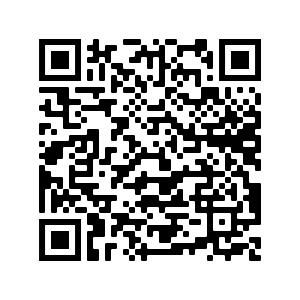

# Lightstreamer - Stock-List Demo with GCM Push Notifications - Android Client

This project contains a full example of an Android application that employs the [Lightstreamer Android Client library](http://www.lightstreamer.com/latest/Lightstreamer_Allegro-Presto-Vivace_6_0_Colosseo/Lightstreamer/DOCS-SDKs/sdk_client_android/doc/API-reference/index.html)
to subscribe to real-time updates and GCM push notifications.

A simpler version, without GCM support is also available: [Stock-List Demo - Android Client](https://github.com/Weswit/Lightstreamer-example-AdvStockList-client-android)

## Live Demo

 

###[ View live demo](https://market.android.com/details?id=com.lightstreamer.demo.android)
(To install the app from the Google Play Store, you can also use the above QR code)

## Details

This is a Java-for-Android version of the [Lightstreamer - Basic Stock-List Demo - HTML client](https://github.com/Weswit/Lightstreamer-example-StockList-client-javascript#basic-stock-list-demo---html-client). 
This app uses the <b>Android Client API for Lightstreamer</b> to handle the communications with Lightstreamer Server. A simple user interface is implemented to display the real-time data received from Lightstreamer Server. 

Touch a row opens a new panel with the detailed information, updated in real-time, of the stock.

Touch the chart to setup a new trigger for push notifications.
    
The demo is ready to receive Mobile Push Notification through [Google Cloud Messaging for Android](https://developer.android.com/google/gcm/index.html).

### Dig the Code

* `StockListDemo.java` is the entry point and only `Activity` of the application. It contains two `Fragment`s, the status of
the application, and acts as a proxy to the LightstreamerClient instance. The two `Fragment` are both visible if the application
runs on tablet; on the contrary, only one `Fragment` is visible and are exchanged based on the user interaction
* `LightstreamerClient.java` handles the connection to the Lightstreamer server and the Subscription/Unsubscription requests
issued by the various part of the application.
* `SubscriptionFragment.java` represents a `Fragment` containing a subscription that is started/stopped based on the lifecycle of 
the `Fragment`. Please note that this class does not actually extend `Fragment`.
* `StocksFragment.java` and `DetailsFragment.java` are the classes representing the two fragments of the application. 
* `GcmIntentService.java` is the class dedicated to receive the Push Notifications, to create the notification for the system, and 
to attach to it an Intent capable of launching the Demo application focused on the notified item.
* `Chart.java` wraps the AndroidPlot APIs to plot the real-time chart on the details fragment.

Check out the sources for further explanations.
  
*NOTE: Not all the functionalities of the Lightstreamer Android Java client are exposed by the classes listed above. You can easily expand those functionalities using the [Android Client API](http://www.lightstreamer.com/latest/Lightstreamer_Allegro-Presto-Vivace_6_0_Colosseo/Lightstreamer/DOCS-SDKs/sdk_client_android/doc/API-reference/index.html) as a reference. If in trouble check out the [specific Lightstreamer forum](http://forums.lightstreamer.com/forumdisplay.php?33-Android-Client-API).*

## Install

Binaries for the application are not provided, but it may be downloaded from the Google Play Store at [this address](https://play.google.com/store/apps/details?id=com.lightstreamer.demo.android). The downloaded app will connect to Lightstreamer's online demo server.

## Build

To build your own version of the demo, please consider that this example is comprised of the following folders:
* `/src` Contains the sources to build the Java-for-Android application.
* `/res` Contains the images and other resourced needed to the demo. 
* `/lib` Drop here the `ls-android-client.jar` from the Lighstreamer SDK for Android Clients and
`androidplot-core.jar` from the Androidplot library, to be used for the build process.

The demo has also references to the [Google Play Services lib](https://developer.android.com/google/play-services/setup.html) 
and to the [v7 Support Library](https://developer.android.com/tools/support-library/setup.html).
  
### Getting Started

You can import the sources on a new project on [Eclipse](http://www.eclipse.org/) (provided you installed the necessary
[ADT plugin](http://developer.android.com/sdk/eclipse-adt.html)) or on [Android Studio](https://developer.android.com/sdk/installing/studio.html).
In the former case, you'll need to separately download the [Android SDK](http://developer.android.com/sdk/).

Once the project has been imported, a couple of dependencies have to be satisfied: `android-support-v7-appcompat` and `google-play-services_lib`.
Please follow the related guides: [Google Play Services lib](https://developer.android.com/google/play-services/setup.html) and 
[v7 Support Library](https://developer.android.com/tools/support-library/setup.html).

### Push Notifications

* Before running the application for the first time, you might want to fill the `senderId` constant in the `res/values/strings.xml` file 
with your own [GCM sender ID](http://developer.android.com/google/gcm/gs.html).
* It is also required that the Lightstreamer Server pointed by the demo application is properly configured to handle Push Notification
Subscriptions. See the server documentation for further details.
 
You can skip these steps: in this case, push notifications will be disabled. 

### Compile and Run

A full local deploy of this app requires a Lightstreamer Server 6.0 or greater installation with appropriate Mobile Push Notifications (MPN) module configuration. A detailed step by step guide for setting up the server and configuring the client is available in the README of the following project:

* [Lightstreamer - MPN Stock-List Demo Metadata - Java Adapter](https://github.com/Weswit/Lightstreamer-example-MPNStockListMetadata-adapter-java)

### Deploy
  
You may run the demo against your local server or using our online server at http://push.lightstreamer.com:80. The server to which the demo will connect to is configured in the `res/values/strings.xml` file.
In the former case, the example requires that the [QUOTE_ADAPTER](https://github.com/Weswit/Lightstreamer-example-Stocklist-adapter-java) and [LiteralBasedProvider](https://github.com/Weswit/Lightstreamer-example-ReusableMetadata-adapter-java) have to be deployed in your local Lightstreamer server instance. 
The factory configuration of Lightstreamer server already provides this adapter deployed. Extra configuration on the server to enable
Push Notification might be needed. 

## See Also

### Lightstreamer Adapters Needed by This Demo Client

* [Lightstreamer - Stock-List Demo - Java Adapter](https://github.com/Weswit/Lightstreamer-example-Stocklist-adapter-java)
* [Lightstreamer - MPN Stock-List Demo Metadata - Java Adapter](https://github.com/Weswit/Lightstreamer-example-MPNStockListMetadata-adapter-java)

### Related Projects

* [Lightstreamer - Stock-List Demos - HTML Clients](https://github.com/Weswit/Lightstreamer-example-Stocklist-client-javascript)
* [Lightstreamer - Stock-List Demo - Android Client](https://github.com/Weswit/Lightstreamer-example-AdvStockList-client-android)

## Lightstreamer Compatibility Notes

* Compatible with Lightstreamer Android Client API v. 1.1 or newer.
* For Lightstreamer Allegro (+ Android Client API support), Presto, Vivace.
